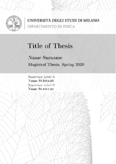
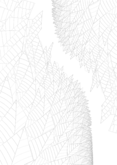
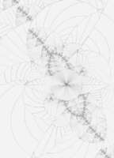
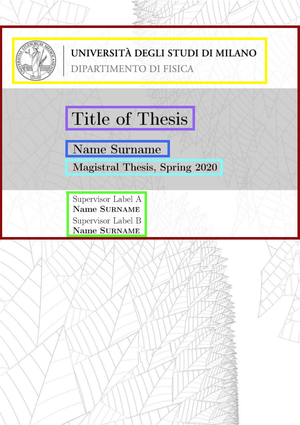
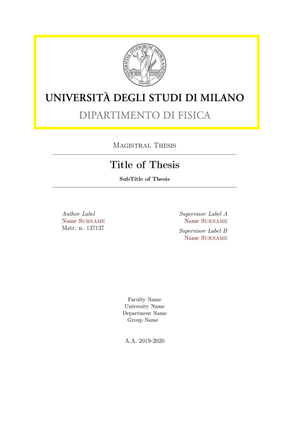

# Custom Thesis Template

An elegant LaTeX thesis template designed to be easily customizable

## Table of contents

  - [Features](#features)
  - [Getting started](#getting-started)
  - [Configuration](#configuration)
    - [info.tex](#infotex)
    - [config.tex](#configtex)
      - [document class](#document-class)
      - [additional packages](#additional-packages)
      - [front cover page](#front-cover-page)
      - [title page](#title-page)
      - [formal pages](#formal-pages)
      - [tables of contents (TOC)](#tables-of-contents-toc)
      - [margin options](#margin-options)
      - [colour options](#colour-options)
      - [hypertext options](#hypertext-options)
      - [bibliography options](#bibliography-options)
    - [chapters.tex](#chapterstex)
    - [appendices.tex](#appendicestex)
  - [Compilation](#compilation)
  - [Licensing](#licensing)

## Features

-   Cover, possibility to choose between:

    -   **informal cover** particularly suitable for ink prints on flexible cardboard

        Front Cover [web-5] | Back Cover [web-5]
        :---: | :---:
         | 

        Other types of wallpapers available:

        web-1 | web-2 | web-3
        :---: | :---: | :---:
         |  | 

        web-4 | web-6 | web-7
        :---: | :---: | :---:
         |  | 

        web-8 | web-9 | web-10
        :---: | :---: | :---:
         |  | 

        But there is no limit to the imagination, free to add new wallpapers inside `Figures/Backgrounds`

    -   **formal cover** particularly suitable for silkscreen printing

        Front Cover | Back Cover
        :---: | :---:
         | 

-   Easy customization, thanks to the `tex` files contained in the `Config` folder:

    -   [info.tex](#infotex), to modify all the properties of the document (title, author, supervisor, co-rapporteur, university, etc ...)

    -   [config.tex](#configtex), to modify all the properties of the main class `main.cls`, the covers and the composition of the document in its parts (index, summary, thanks, bibliography, etc ...)

    -   [chapters.tex](#chapterstex), to add, remove or comment on chapters

    -   [appendices.tex](#appendicestex), to add, remove or comment on appendices

## Getting started

Download the template by cloning the repository:

```shell
git clone https://github.com/andros21/Beauty-Thesis-Template.git
cd Beauty-Thesis-Template
```

Or, by downloading the repository `zip` file:

```shell
wget https://github.com/andros21/Beauty-Thesis-Template/archive/master.zip
unzip master.zip
cd Beauty-Thesis-Template
```

## Configuration

### info.tex

Path: `Config/info.tex`

field | description | example
:--- | :--- | :---
Title               | Title of thesis | *Random Analysis*
SubTitle            | Subtitle of thesis | *No subtitle*
DegreeName          | Type of thesis | *Master thesis, PhD thesis*
Date                | Date of the session, or nickname of the session | *23-11-2020, Spring 2020*
AuthorLabel         | Label of the author | *Author, Student*
AuthorName          | Name of the Author | *Andrew*
AuthorSurName       | Surname of the Author | *Red*
SupervisorLabelA    | Label of the 1st supervisor | *Supervisor, Collaborator*
SupervisorNameA     | Name of the 1st supervisor | *Carl*
SupervisorSurNameA  | Surname of the 1st supervisor | *Franz*
SupervisorLabelB    | Label of the 2nd supervisor | *Supervisor, Correlator*
SupervisorNameB     | Name of the 2nd supervisor | *Margaret*
SupervisorSurNameB  | Surname of the 2nd supervisor | *White*
Faculty             | Faculty of the  University | *Science and Technologies Faculty*
University          | University name | *University of Milan*
DepartmentName      | Department name | *Department of Physics*
GroupName           | Group of research name | *Complex Systems Groups*

All fields deemed unnecessary can be removed from the document leaving the corresponding field empty, e.g. `\newcommand{GroupName}{}`

### config.tex

Path: `Config/config.tex`

#### document class

The template is based on a `\documentclass{book}`,
the modifiable options are:

option | default | description
:--- | :--- | :---
font-size | *11pt* | Sets the size of the main font in the document
document-visualization | *twoside* | Specifies whether double or single sided output should be generated, choose between *oneside* or *twoside* (perfect for printing)
language | *english* | Default document language, available *italian*, *english*, *german*, *austrian*
line-spacing | *singlespacing* | Spacing between newlines, available *singlespacing*, *onehalfspacing*, *doublespacing*
draft         | *disabled* | If *enabled*, enable draft mode (no pictures, no links, no overfull hboxes indicated)
nolistspacing | *disabled* | If *enabled*, avoid too much space when line-spacing is *onehalfspacing* or *doublespacing*
liststotoc    | *disabled* | If *enabled*, add the list of figures/tables/etc to the table of contents
toctoctoc     | *disabled* | If *enabled*, add the main table of contents to the table of contents
parskip       | *disabled* | If *enabled*, add space between paragraphs
nohyperref    | *disabled* | If *enabled*, do not load the `hyperref` package
headsepline 	| *enabled*  | If *enabled*, get a line under the header
chapterinoneline | *disabled* | If *enabled*,  place the chapter title next to the number on one line
consistentlayout | *disabled* | If *enabled*, change the layout of the **declaration page**

**Clarification**, with *disabled* I mean *comment* and with *enabled* I mean *uncomment*\
For other options or concerns, reference [https://en.wikibooks.org/wiki/LaTeX/Document_Structure](https://en.wikibooks.org/wiki/LaTeX/Document_Structure#Preamble)

#### additional packages

All the packages needed to operate the template have already been added to the `main.cls` and` main.sty` files. For any other type of need for additional packages, insert them in the appropriate section in the `config.tex` or uncomment those already present, for example:

```latex
%%%
%%%%% ADDITIONAL PACKAGES, remove or uncomment examples and please add here other ones
%%%

% Scientific Packages
\usepackage{amsmath}
\usepackage{amsthm}
\usepackage{amssymb}
\usepackage{mathtools}
\usepackage{physics}
```

#### pictures option

The `graphicx` package is loaded by default, the `Figures` folder is set as default `graphicspath`, so all the media files that you want to use inside the document, must be added inside this folder

#### front cover page

The front cover is defined within the `main.sty` file, the modifiable options are:

option | default | description
:--- | :--- | :---
FrontCoverBool | *true* | If *true* **informal cover** is selected, if *false* **formal cover** is selected, see [Features](#Features) for differences between the two covers

If `\newcommand{FrontCoverBool}{true}`, otherwise bypass this table:

informal cover opt | default | description
:--- | :--- | :---
FrontCoverBackgroundNumber | *5* | The 5th wallpaper, 10 wallpapers available from *1* to *10*
FrontCoverBackgroundType  | *print* | If *print* high resolution wallpaper is used, if *web* low resolution wallpaper is used
FrontCoverStripColourA  | *white* | Colour of the 1st strip (from the top), see [colours](colours)
FrontCoverStripOpacityA | *0.8* | Opacity of the 1st strip (from the top), values from *0* to *1*
FrontCoverStripColourB  | *stripgrey* | Colour of the 2nd strip, see [colours](colours)
FrontCoverStripOpacityB | *0.7* | Opacity of the 2nd strip, values from *0* to *1*
FrontCoverStripColourC  | *white* | Colour of the 3rd strip, see [colours](colours)
FrontCoverStripOpacityC | *0.8* | Opacity of the 3rd strip, values from *0* to *1*
FrontCoverStripsY       | *130mm* | Distance between STRIPB bottom border and PAGE bottom border
FrontCoverBannerPath    | `Banners/banner` | Path of front cover university banner, YELLOW-BOX
FrontCoverBannerScale   | *1.4* | Scale of front cover university banner, YELLOW-BOX scale
FrontCoverBannerX       | *10mm* | Distance between YELLOW-BOX left border and PAGE left border
FrontCoverBannerY       | *110mm* | Distance between YELLOW-BOX top border and STRIPB bottom border
FrontCoverTitleFont     | *50* | Title font size
FrontCoverTitleFontSpace | *50* | Title newlines space
FrontCoverTitleX        | *40mm* | Distance between PURPLE-BOX left border and YELLOW-BOX left border
FrontCoverTitleY        | *30mm* | Distance between PURPLE-BOX top border and YELLOW-BOX top border
FrontCoverAuthorFont     | *25* | Author font size
FrontCoverAuthorFontSpace | *25* | Author newlines space
FrontCoverAuthorX        | *0mm* | Distance between BLUE-BOX left border and PURPLE-BOX left border
FrontCoverAuthorY        | *20mm* | Distance between BLUE-BOX top border and PURPLE-BOX top border
FrontCoverDegreeFont     | *20* |  DegreeName, Date font size, see [info.tex](infotex)
FrontCoverDegreeFontSpace | *20* | DegreeName, Date newlines space, see [info.tex](infotex)
FrontCoverDegreeX        | *0mm* | Distance between CYAN-BOX left border and BLUE-BOX left border
FrontCoverDegreeY        | *12mm* | Distance between CYAN-BOX top border and BLUE-BOX top border
FrontCoverSupervisorFont     | *18* |  SupervisorName font size, see [info.tex](infotex)
FrontCoverSupervisorFontSpace | *20* | SupervisorName newlines space, see [info.tex](infotex)
FrontCoverSupervisorX        | *0mm* | Distance between GREEN-BOX left border and CYAN-BOX left border
FrontCoverSupervisorY        | *4mm* | Distance between GREEN-BOX top border and STRIPB bottom border

Informal cover boxes | Formal cover boxes
:---: | :---:
 | 

If `\newcommand{FrontCoverBool}{false}`, otherwise bypass this table:

formal cover opt | default | description
:--- | :--- | :---
MarkPath | `Marks/mark` | Path of front cover university mark, YELLOW-BOX
MarkScale | *1.5* | Scale of front cover university mark, YELLOW-BOX scale

#### title page

The **title page** is in fact a duplicate of the **formal cover** inserted inside the thesis immediately after the cover, so the options coincide with those of the **formal cover** inside the `config.tex`

So if `\newcommand{FrontCoverBool}{false}`, you should have the options for the **title page** already set.
If `\newcommand{FrontCoverBool}{true}`, set them now:

formal cover opt | default | description
:--- | :--- | :---
MarkPath | `Marks/mark` | Path of front cover university mark, YELLOW-BOX
MarkScale | *1.5* | Scale of front cover university mark, YELLOW-BOX scale

#### formal pages

By formal pages I mean:

formal page | path | description
:--- | :--- | :---
Declaration | `Vars/declaration.tex` | Declaration of authenticity page
Quotation | `Vars/quotation.tex` | Maybe some authoritative quote page
Abstract | `Vars/abstract.tex` | A little summary of the thesis work
Acknowledgements | `Vars/acknowledgements.tex` | Acknowledgements to someone

Free to modify each of these formal pages within `Vars`, the options available within `config.tex`, instead, are: enable them *true* or disable them *false*

formal page opt | default
:--- | :---
DeclarationBool       | *false*
QuotationBool         | *false*
AbstractBool          | *true*  
AcknowledgementsBool  | *false*

#### tables of contents (TOC)

The main table of contents is obviously enabled by default and already has links to chapters, appendices, bibliography. You can opt to add additional content tables (enabled *true*, disabled *false*) that LaTeX auto generates according to the content of the thesis

TOC | default | description
:--- | :--- | :---
ListofFiguresBool | *false* | TOC for figures inside document
ListofTablesBool  | *false* | TOC for tables inside document

Other types of TOC **not auto generated** by LaTeX, are the following pages, which can also be modified at the indicated path, and again enabled *true* or disabled *false* inside `config.tex`

OTOC | path | description
:--- | :--- | :---
Abbreviations | `Vars/abbreviations.tex`| List of abbreviations used inside the document
Costants      | `Vars/costants.tex`     | List of constants used inside the document
Symbols       | `Vars/symbols.tex`      | List of symbols used inside the document

OTOC opt | default
:--- | :---
AbbreviationsBool | *false*
CostantsBool      | *false*
SymbolsBool       | *false*

#### back cover page

Choose the type of back cover page, available options:

back cover opt | default | description
:--- | :--- | :---
BackCoverBool | *true* | If *true* use the **informal page** type also for backcover, if *false* blank page
BackCoverBackgroundNumber | *5* | The 5th wallpaper, 10 wallpapers available from *1* to *10* as for [front cover page](#front-cover-page)

**Clarification**, yes, this is an extra option (a stupid option), because if `\newcommand {FrontCoverBool}{true}` presumably you want the same wallpaper for the **back cover page**, otherwise if `\newcommand{FrontCoverBool}{false}` you want a blank page

#### margin options

The `geometry` package provides an easy and flexible user interface to customize page layout, for the list of the full options visit [https://www.ctan.org/pkg/geometry](https://www.ctan.org/pkg/geometry)\
Minor changes to the page layout are available inside the `config.tex` file (thanks to the `geometry` package):

geometry opt | default | description
:--- | :--- | :---
bindingoffset | *0.5cm* | Removes a specified space from the lefthand-side of the page for *oneside* or *the inner-side* for twoside, see ...
top | *1.5cm* | Top margin of the page
bottom | *1.5cm* | Bottom margin of the page

#### colour options

Add custom colours thanks to the package `xcolor`, to use them within the template, for example for the color of the stripes on the front cover page or as a color for hypertext links. The colours set by
default are two: `mdtRed` (hypertext color) and` stripgrey` (front cover strip color)\
Full reference on the topic here [https://en.wikibooks.org/wiki/LaTeX/Colors](https://en.wikibooks.org/wiki/LaTeX/Colors)

#### hypertext options

The `hyperref` package is used to handle cross-referencing commands in LaTeX to produce hypertext links in the document, for the list of the full options visit [https://www.ctan.org/pkg/hyperref](https://www.ctan.org/pkg/hyperref). Minor changes to the hypertext layout are available inside the `config.tex` file (thanks to the `hyperref` package):

hyperref opt | default | description
:--- | :--- | :---
pdfpagemode         | *{UseOutlines}* | Determines how the file (`main.pdf`) is opening inside the PDF reader, e.g. *UseOutlines* show bookmarks
bookmarksopen       | *true* | If *true* open up bookmark tree (inside the PDF reader)
bookmarksopenlevel	| *0* | Level to which bookmarks are open (inside the PDF reader), e.g. `\maxdimen` (max level tree)
hypertexnames			  | *false* | If *true* use guessable names for links
hidelinks           | *disabled* | If *enabled* links are hidden ( color and border are removed)
colorlinks				  | *true* | If *true* colors the text of links and anchors
citecolor				    | *mdtRed* | The color of citations from bibliography (when `\cite` command is used)
linkcolor				    | *mdtRed* | The color of references to document elements (sections, figures, etc)
urlcolor				    | *magenta* |	The color of web links (URLs)
pdfstartview			  | *{FitV}* | Set the startup page view, e.g. *FitV* fits the height of the page to the window
unicode             | *enabled* | If *enabled* unicode encoded PDF strings
breaklinks				  | *true* | If *true* allow links to break over lines

**Clarification**, with *disabled* I mean *comment* and with *enabled* I mean *uncomment*

#### bibliography options

The bibliography is enabled by default and is contained in the `main.bib` file, so free to add and modify it, the available options of `bibLaTeX` package editable editable in `config.tex` are:

biblatex opt | default | description
:--- | :--- | :---
backend | *biber*			  |	Specifies the database backend. The following backends are supported: *biber*, *bibtex*, *bibtex8*
style   | *alphabetic*  | Citation styles

BibLaTeX reference [https://www.ctan.org/pkg/biblatex](https://www.ctan.org/pkg/biblatex)\
Biber reference [https://www.ctan.org/pkg/biber](https://www.ctan.org/pkg/biber)\
Available styles [https://www.overleaf.com/learn/latex/Biblatex_citation_styles](https://www.overleaf.com/learn/latex/Biblatex_citation_styles)

### chapters.tex

Path: `Config/chapters.tex`

Depending on the needs, comment or uncomment the chapters, contained within the `Chapters` folder, which you want to insert into the document. For additional needs, just add new chapters with the same command `\include{Chapters/ChapterXXX}`

### appendices.tex

Path: `Config/appendices.tex`

Depending on the needs, comment or uncomment the appendices, contained within the `Appendices` folder, which you want to insert into the document. For additional needs, just add new appendices with the same command `\include{Appendices/AppendixAAA}`

## Compilation

**Custom-Thesis-Template** was only tested with **pdfLaTeX** compiler !\
To full compile **Custom-Thesis-Template** follow this standard scheme:

```shell
pdflatex main.tex
biber main.tex # or bibtex main.tex or bibtex8 main.tex, depending on the chosen backend
pdflatex main.tex
pdflatex main.tex
```

after the first compilation, if the bibliography is not modified or bibliographic citations are not inserted, it is possible to compile using only:

```shell
pdflatex main.tex
pdflatex main.tex
```

## Licensing

One really important part: Give your project a proper license. Here you should
state what the license is and how to find the text version of the license.
Something like:

"The code in this project is licensed under MIT license."
